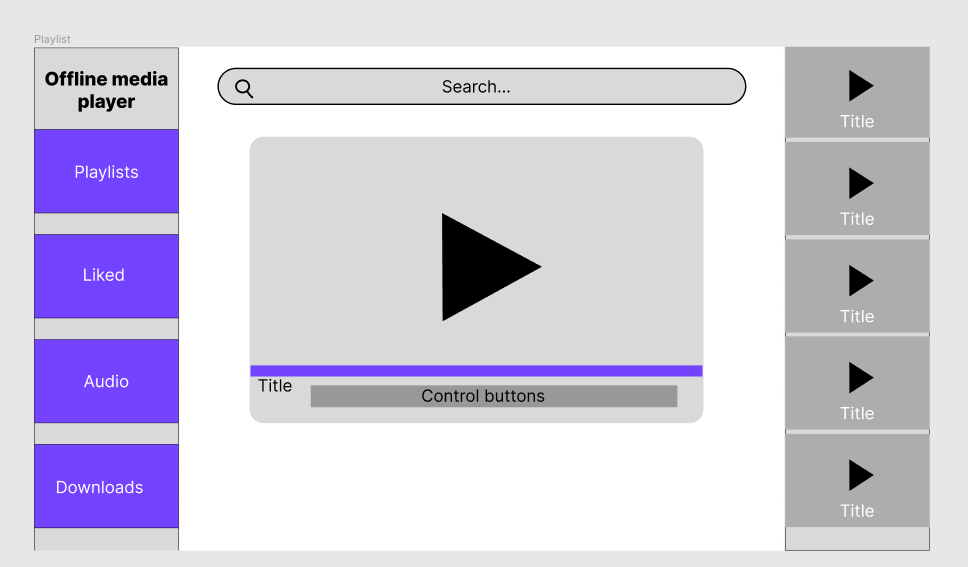

# Offline Video Reader

This Project was create to read offline media from Youtube, it is for people with low connexion or simply to save your best tutorials !

## ⚠️  Disclaimer ⚠️

Please do not use this software to repost on youtube because videos  repost it's forbiden by youtube terms of service for copyrighted contents.

---

# Documenation

## UML:

### Use Case

You can find ``usecases diagram`` in this section:

[Show usecases diagram](./UML//Usecases/Usecases.png)

#### A user can :

<small>*Download, read video, audio content and more...*</small>

* Install Software
  * Accept terms of Service
* Create Playlist
  * Add media
* Download media
  * Enter URL
  * Choose media quality
  * Choose Playlist
* Read media
  * Handle seekbar
  * toggle play button
  * Handle sound volume
* Show all playlists
  * Read a playlist
    * Remove media
    * Like media
* Show liked playlist
  * Read playlist
  * Remove media from likes

### Sequences Diagrams:

* Install Software
  * <small>[Show diagram](./UML/Sequences/Install-Software/Install-Software.png)</small>
* Create Playlist
    * <small>[Show diagram](./UML/Sequences/Create-Playlist/Create-Playlist.png)</small>
* Download Media
    * <small>[Show diagram](./UML/Sequences/Download-Media/Download-Media.png)</small>
* Remove Media
    * <small>[Show diagram](./UML/Sequences/Remove-media/Remove-media.png)</small>
* Show All Playlist
  * <small>[Show diagram](./UML/Sequences/Show-All-Playlist/Show-all-playlist.png)</small> 
* Read Playlist
  * <small>[Show diagram](./UML/Sequences/Read-Playlist/Read-playlist.drawio)</small> 
* Remove Playlist
  * <small>[Show diagram](./UML/Sequences/Remove-playlist/Remove-playlist.png)</small>
* Like / Unlike 
  * <small>[Show diagram](./UML/Sequences/Like-Unlike-Media/Like-Unlike-Media.png)</small>

---

# Mockup Desktop:

## Components:

<b>Click here</b> to show Components 

## Index View( All Playlist ):

<b>Click here</b> to show Index View

## Read Playlist

<b>Click here</b> to show Playlist View 

## Read Audio Playlist

<b>Click here</b> to show Audio Playlist 

